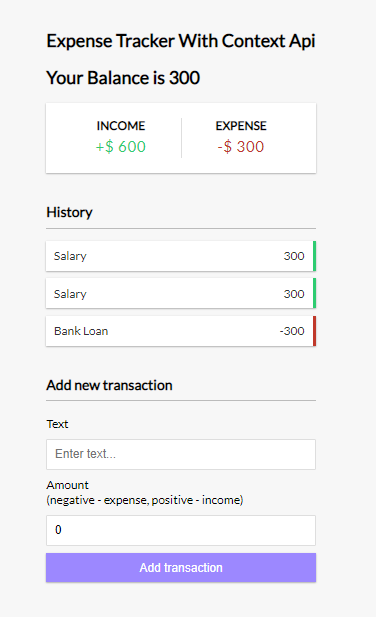

# Expense Tracker App with Context Api

  

I have decided to move out my Laravel comfortzone, therefore I have started learning react. In this project I have learnt and implemented the following react concepts.

  

### React Concepts

 1. Decomposing a page into multiple reusable components.
 2. Props passing which eventually led to props drilling
 3. Context Api for global state management, the solution of props drilling

  
### Live link of the project
[https://hassanjrao.github.io/expense-tracker22/](https://hassanjrao.github.io/expense-tracker22/)